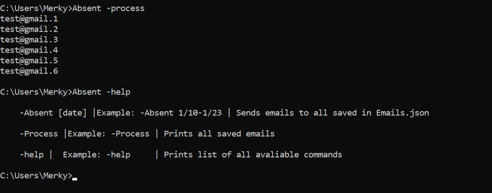

# Email-Automation
!
```
Run in script directory: python setup.py develop

Allows script to be used in CMD globally

Command-List:
-Absent [date] |Example: -Absent 1/10-1/23 | Sends emails to all saved in Emails.json
          
-Process |Example: -Process | Prints all saved emails
          
-help |  Example: -help     | Prints list of all avaliable commands
```

**Example**


